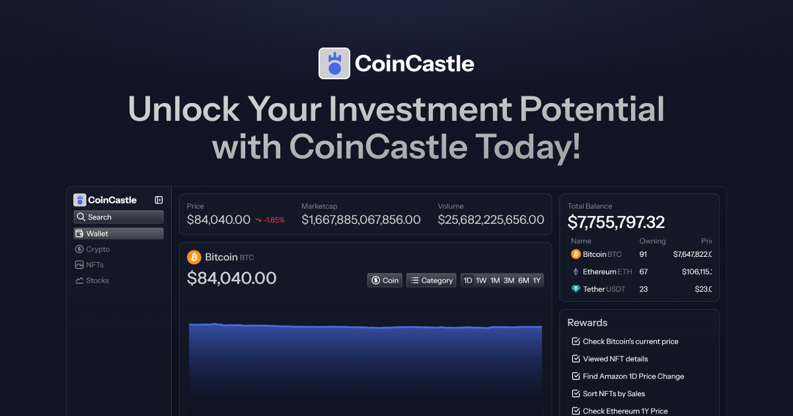

#  CoinCastle

A web-based SaaS for Tracking Cryptocurrencies, NFTs, and Stocks

### Link for [Live Demo](https://coincastle-demo-app.netlify.app/)



## Table of Contents

- [Features](#features)
- [Tech Stack](#tech-stack)
- [Setup and Installation Instructions](#setup-and-installation-instructions)
- [API Documentation](#api-documentation)
- [License](#license)

## Features

- **Real-time Tracking:** View up-to-date prices and details for cryptocurrencies, NFTs, and stocks all in one place.
- **Powerful Search & Filtering:** Quickly find assets with advanced search and filtering options tailored for crypto, NFTs, and stocks.
- **Historical Data:** Access historical price data to analyze long-term trends.
- **Theme Customization:** Choose between different visual themes to personalize your experience.
- **Customizable Charts:** Switch between multiple chart types to analyze asset performance visually.
- **Interactive Charts:** Visualize asset trends using dynamic charts powered by Recharts.

## Tech Stack

- **Framework:** React
- **Language:** TypeScript
- **Build Tool:** Vite
- **Styling:** Tailwind CSS
- **Data Fetching & Caching:** React Query
- **Charting Library:** Recharts
- **API Integration:** External APIs for Crypto Currencies, NFTs, and Stocks data

## Setup and Installation Instructions

1. Clone the repository:
   ```bash
   git clone https://github.com/rveljko/coincastle.git
   ```
2. Navigate into the project directory:
   ```bash
   cd coincastle
   ```
3. Install dependencies:
   ```bash
   npm install
   ```
4. Configure environment variables:

- Create a `.env` file in the root directory with the following variables:

  ```
  VITE_PUBLIC_POSTHOG_KEY=
  VITE_PUBLIC_POSTHOG_HOST=

  VITE_COINGECKO_API_KEY=
  VITE_MORALIS_API_KEY=
  VITE_FMP_API_KEY=
  ```

- You can get your API keys from these sites:

  - **PostHog**: [https://us.posthog.com/signup](https://us.posthog.com/signup)
  - **CoinGecko API key**: [https://www.coingecko.com/account/sign_up](https://www.coingecko.com/account/sign_up)
  - **Moralis API key**: [https://admin.moralis.com/register](https://admin.moralis.com/register)
  - **Financial Modeling Prep API key**: [https://site.financialmodelingprep.com/register](https://site.financialmodelingprep.com/register)

5. Start the development server:
   ```bash
   npm run dev
   ```
6. Open your browser and navigate to:
   ```
   http://localhost:5173
   ```

## API Documentation

### Cryptocurrency API Documentation

#### Base URL

```
https://api.coingecko.com/api/v3
```

#### Authentication

All cryptocurrency API requests require the `X-Cg-Demo-API-Key` header with your CoinGecko API key.

#### Get Cryptocurrencies Market Data

**GET** `/coins/markets`

List supported cryptocurrencies with market data such as current price, market cap, and volume.

**Query Parameters:**

- `vs_currency` (string, required) — Currency to compare against (e.g., `usd`)
- `order` (string, required) — Order results by a field and direction. Format: `{sortField}_{sortDirection}`, e.g., `market_cap_desc`
- `per_page` (integer, optional) — Number of coins to return per page (default varies)

**Example Request:**

```http
GET /coins/markets?vs_currency=usd&order=market_cap_desc&per_page=50
X-Cg-Demo-API-Key: YOUR_API_KEY
```

**Response:**  
Array of cryptocurrency market data objects including price, market cap, and 24h volume.

#### Get Coin Information by ID

**GET** `/coins/{id}`

Retrieve detailed information about a specific coin by its ID.

**Example Request:**

```http
GET /coins/bitcoin
X-Cg-Demo-API-Key: YOUR_API_KEY
```

**Response:**  
Includes coin metadata, market data, description, links, developer and community stats.

#### Get Coin Market Chart Data

**GET** `/coins/{id}/market_chart`

Get historical market chart data for a coin.

**Query Parameters:**

- `vs_currency` (string, required) — Comparison currency (e.g., `usd`)
- `days` (string or number, required) — Number of days to fetch data for (e.g., `1`, `30`, `max`)

**Example Request:**

```http
GET /coins/bitcoin/market_chart?vs_currency=usd&days=30
X-Cg-Demo-API-Key: YOUR_API_KEY
```

**Response:**  
Time-series data including prices, market caps, and total volumes over the period.

#### Search Cryptocurrencies by Name or Symbol

**GET** `/search`

Search cryptocurrencies by query string.

**Query Parameters:**

- `query` (string, required) — Search term to match coin name or symbol

**Example Request:**

```http
GET /search?query=bitcoin
X-Cg-Demo-API-Key: YOUR_API_KEY
```

**Response:**  
List of matching cryptocurrencies with IDs and symbols for further queries.

#### Error Handling

If a request fails, the API returns an error status and a message such as:

- `'Failed to fetch all cryptocurrencies. Please check your connection and try again.'`
- `'Failed to fetch coin information. Ensure the coin symbol or ID is correct and try again.'`
- `'Failed to fetch coin chart information. Check the coin symbol or ID and time period, then try again.'`
- `'Failed to fetch cryptocurrencies by search. Please check your connection and try again.'`

### NFT API Documentation

#### Base URL

```
https://deep-index.moralis.io/api/v2.2
```

#### Authentication

All NFT API requests require the `X-API-Key` header containing your Moralis API key.

#### Get NFT Collections

**GET** `/market-data/nfts/hottest-collections`

Fetches a list of the hottest NFT collections.

**Example Request:**

```http
GET /market-data/nfts/hottest-collections
X-API-Key: YOUR_API_KEY
```

**Response:**  
Returns an overview list of NFT collections.

#### Get NFT Collection Information

**GET** `/nft/{contractAddress}/metadata`

Fetch detailed info about a specific NFT collection by contract address.

**Example Request:**

```http
GET /nft/0xabc123...def/metadata
X-API-Key: YOUR_API_KEY
```

**Response:**  
Detailed metadata and attributes of the NFT collection.

#### Get NFT Collection Statistics

**GET** `/nft/{contractAddress}/price`

Get statistical data for an NFT collection.

**Example Request:**

```http
GET /nft/0xabc123...def/price
X-API-Key: YOUR_API_KEY
```

**Response:**  
Includes metrics like price trends, volume, and other statistics.

#### Get NFTs in a Collection

**GET** `/nft/{contractAddress}?cursor={cursor}&limit={limit}&normalizeMetadata=true&include_prices=true`

Fetch NFTs belonging to a specific collection with pagination and metadata normalization.

**Query Parameters:**

- `cursor` (string) — Pagination cursor for next page
- `limit` (number) — Number of NFTs to return

**Example Request:**

```http
GET /nft/0xabc123...def?cursor=xyz123&limit=20&normalizeMetadata=true&include_prices=true
X-API-Key: YOUR_API_KEY
```

**Response:**  
List of NFTs with pagination support and price info.

#### Get Single NFT Details

**GET** `/nft/{contractAddress}/{tokenId}`

Fetch detailed information for a single NFT by contract address and token ID.

**Example Request:**

```http
GET /nft/0xabc123...def/1
X-API-Key: YOUR_API_KEY
```

**Response:**  
Metadata and detail of the specific NFT.

#### Get NFTs Owned by Wallet

**GET** `/{walletAddress}/nft?chain=eth&format=decimal&cursor={cursor}&limit={limit}&normalizeMetadata=true&include_prices=true`

Retrieve NFTs owned by a wallet address with pagination and metadata normalization.

**Query Parameters:**

- `cursor` (string) — Pagination cursor
- `limit` (number) — Number of NFTs to return

**Example Request:**

```http
GET /0xwallet123/nft?chain=eth&format=decimal&cursor=abc123&limit=20&normalizeMetadata=true&include_prices=true
X-API-Key: YOUR_API_KEY
```

**Response:**  
Paginated list of NFTs owned by the wallet.

#### Get Wallet NFT Statistics

**GET** `/wallets/{walletAddress}/stats?chain=eth`

Get overall NFT statistics for a wallet address.

**Example Request:**

```http
GET /wallets/0xwallet123/stats?chain=eth
X-API-Key: YOUR_API_KEY
```

**Response:**  
General statistics about the wallet's NFT portfolio.

#### Error Handling

If a request fails, the API will return an appropriate HTTP status code and an error message such as:

- `'Failed to fetch NFT collections. Please check your connection and try again.'`
- `'Failed to fetch NFT collection information. Ensure the collection ID is correct and try again.'`
- `'Failed to fetch NFT collection statistics. Ensure the collection ID is correct and try again.'`
- `'Failed to fetch NFTs in the collection. Ensure the collection ID is correct and try again.'`

### Stocks API Documentation

#### Base URL

```
https://financialmodelingprep.com/stable
```

#### Authentication

All stock API requests require an API key provided as a query parameter: `apikey=YOUR_API_KEY`.

#### Get Stocks List with Filters

**GET** `/api/v3/stock-screener`

Retrieve a list of stocks filtered by price, market cap, and volume.

**Query Parameters:**

- `country` (string) — Country code for stock market (e.g., `us`)
- `priceMoreThan` (number or empty) — Minimum stock price filter
- `priceLowerThan` (number or empty) — Maximum stock price filter
- `marketCapMoreThan` (number or empty) — Minimum market capitalization filter
- `marketCapLowerThan` (number or empty) — Maximum market capitalization filter
- `volumeMoreThan` (number or empty) — Minimum volume filter
- `volumeLowerThan` (number or empty) — Maximum volume filter
- `limit` (number) — Number of stocks to return
- `apikey` (string) — Your API key

**Example Request:**

```
GET /api/v3/stock-screener?country=us&priceMoreThan=10&priceLowerThan=500&marketCapMoreThan=1000000000&limit=50&apikey=YOUR_API_KEY
```

**Response:**  
Returns an array of stocks matching the specified criteria with key stock overview data.

#### Get Stock Quote Information

**GET** `/quote`

Retrieve real-time quote information for a specified stock symbol.

**Query Parameters:**

- `symbol` (string) — Stock symbol (e.g., `AAPL`)
- `apikey` (string) — Your API key

**Example Request:**

```
GET /quote?symbol=AAPL&apikey=YOUR_API_KEY
```

**Response:**  
Returns current price, change percentage, volume, and other key metrics for the stock.

#### Get Historical Stock Chart Data

**GET** `/historical-price-eod/light`

Fetch historical end-of-day stock price data for a given time period.

**Query Parameters:**

- `symbol` (string) — Stock symbol (e.g., `AAPL`)
- `from` (date string, ISO 8601) — Start date for historical data
- `to` (date string, ISO 8601) — End date for historical data
- `apikey` (string) — Your API key

**Example Request:**

```
GET /historical-price-eod/light?symbol=AAPL&from=2024-01-01&to=2024-08-29&apikey=YOUR_API_KEY
```

**Response:**  
Array of daily stock prices including open, close, high, low, and volume.

#### Search Stocks by Symbol or Name

**GET** `/search-symbol`

Search stocks by symbol or company name (limit 3 results).

**Query Parameters:**

- `query` (string) — Search keyword
- `limit` (number, optional, default 3) — Number of search results
- `apikey` (string) — Your API key

**Example Request:**

```
GET /search-symbol?query=apple&limit=3&apikey=YOUR_API_KEY
```

**Response:**  
List of matching stocks including symbol, company name, and exchange.

#### Error Handling

If a request fails, the API returns an appropriate HTTP error status and a message such as:

- `'Failed to fetch all stocks. Please check your connection and try again.'`
- `'Failed to fetch stock information. Ensure the stock symbol is correct and try again.'`
- `'Failed to fetch stock chart information. Check the stock symbol and time period, then try again.'`
- `'Failed to fetch stocks by search. Please check your query and connection, then try again.'`

## License

This project is licensed under the [Apache License 2.0](LICENSE). See the LICENSE file for more details.
